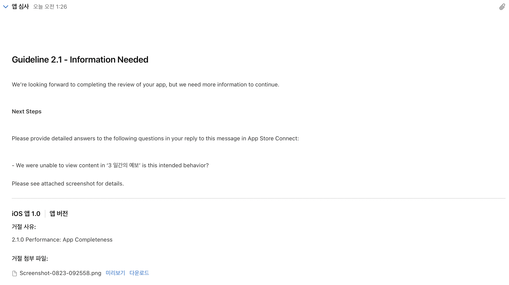

# WeatherApplication

## 개요
 날씨를 확인할 수 있게 해주는 프로젝트. 사용자가 위치한 도시의 현재 날씨와, 이후 3일 동안의 날씨를 출력. 또한, 다른 도시를 검색해서 그곳의 날씨를 확인할 수도 있음.
 
 
 
 
<br></br>
## 사용 기술
|구현 내용|도구|
|---|---|
|아키텍처|MVC|
|UI|UIKit|
|로컬 데이터 저장소| CoreData |
|네트워크|URLSession|
 
<br></br>
## 프로젝트 기간
- 개발 ~ 앱스토어 배포: 2022/08/01 ~ 2022/08/24
- 리팩토링, 업데이트: 진행중

<br></br>
## 사용 API
 [OpenWeather](https://openweathermap.org)

<br></br>
## Files
- Decoder: JSONDecoder
- FetchData: API 호출, 데이터 Fetch
- BookMark: CoreData의 Persistence를 이용하여 즐겨찾기 기능 구현

<br></br>
## 동작
* 현재 위치한 도시
  - CoreLocation을 통해 사용자의 위치 정보를 받아옴.
  - 위치 정보를 이용하여 현재 위치의 도시 이름을 받아옴.
  - 받아온 도시 이름을 이용하여 현재 날씨 데이터와 예보 데이터를 받아옴.
* 다른 도시 검색 
  - 도시 이름을 이용하여 현재 날씨 데이터와 예보 데이터를 받아옴.

<br></br>
## 문제 해결 기록
### UIAlertController의 present 중복 문제
* 에러 처리시, UIAlertController를 사용하여 사용자에게 알림. 하지만 여러 개의 에러가 연쇄되어 발생시, UIAlertController가 어러개 present되면서 에러가 발생.
* 다음과 같이 isBeingPresented를 이용하여 UIAlertController의 present상태를 확인 후 띄워줌. 
```swift
if !self.alert.isBeingPresented {
    self.alert.message = self.apiManager.errorHandler(error: error)
    self.present(self.alert, animated: true, completion: nil)
}
```

<br></br>
### NSLayoutConstraint 변경
* 텍스트 필드에 텍스트를 입력할때, 텍스트필드의 너비가 줄어들면서 숨어있던 버튼이 나오게 하려고 했는데, 단순히 새로운 값을 activate() 해주면, 같은 뷰에 제약이 두 개가 들어가며 레이아웃이 깨짐.
  - 제약의 객체 타입은 NSLayoutConstraint, 해당 객체의 constant 값을 변경
```swift
// 변수로 선언 후, NSLayoutConstraint.activate([])로 다른 뷰들의 제약을 설정해줄때, 적절한 곳에 넣음
private lazy var trailingOfSearchTextField: NSLayoutConstraint = searchTextField.trailingAnchor.constraint(equalTo: view.trailingAnchor, constant: -8)
 
@IBAction func touchUpCancelButton(_ sender: UIButton) {
       searchTextField.text = ""
       searchTextField.resignFirstResponder()
}
func textFieldDidBeginEditing(_ textField: UITextField) {
    UIView.animate(withDuration: 0.2) {
        self.trailingOfSearchTextField.constant = -50
        self.view.layoutIfNeeded()
    }
}
    
func textFieldDidEndEditing(_ textField: UITextField, reason: UITextField.DidEndEditingReason) {
    UIView.animate(withDuration: 0.2) {
        self.trailingOfSearchTextField.constant = -8
        self.view.layoutIfNeeded()
    }
}
```

<br></br>
### UITableView안에 UICollectionView 넣을 때, 데이터 전달하기
* UITalbeView DataSource
```swift
func tableView(_ tableView: UITableView, cellForRowAt indexPath: IndexPath) -> UITableViewCell {
        guard let cell = tableView.dequeueReusableCell(withIdentifier: WeatherForecastTableViewCell.identifier, for: indexPath) as? WeatherForecastTableViewCell else { return UITableViewCell() }
        
        cell.dayLabel.text = dayList[indexPath.row]
        cell.setUpForecast(forecast: forecasts[indexPath.row])
        
        return cell
    }
```
* UITableViewCell
```swift
// 전달받을 변수
private var forecast: Forecast?

override func prepareForReuse() {
    super.prepareForReuse()
    forecast = nil
}
    
// prepare를 통해서 테이블뷰의 indexPath.row마다 다른 데이터를 적용
func setUpForecast(with forecast: Forecast) {
    self.forecast = forecast
}
```

<br></br>
## 심사 reject

* 심사를 미국에서 한다는 것을 생각하지 못하고, 한국의 도시를 기준으로 데이터를 가져옴. 콘텐츠는 한국어로 처리하되, 전 세계 어디에서든 앱을 실행할 수 있도록 명확하게 처리.


<br></br>
## 1.1 업데이트
1. Localization: 어플 이름 한글 표기
2. UINavigationController → UITabBarController
3. 일부 지역에서 날씨 정보를 가져오지 못하던 문제 해결
4. Core Location 관련하여 버그가 발생하는 코드 수정
5. 각 도시의 예보 데이터가 뒤섞이던 버그 수정
6. 그 외 리팩토링


